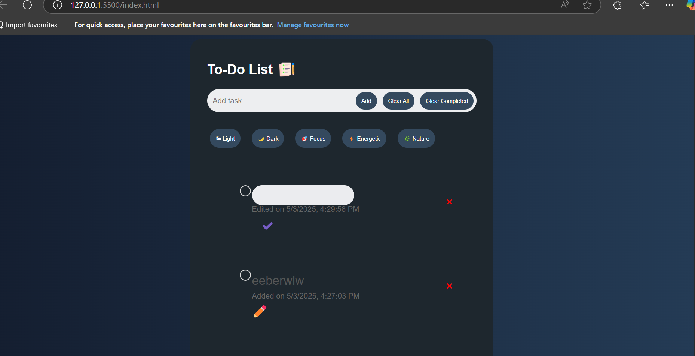
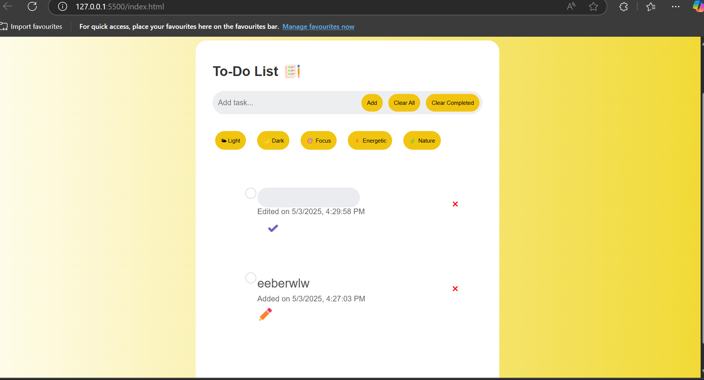
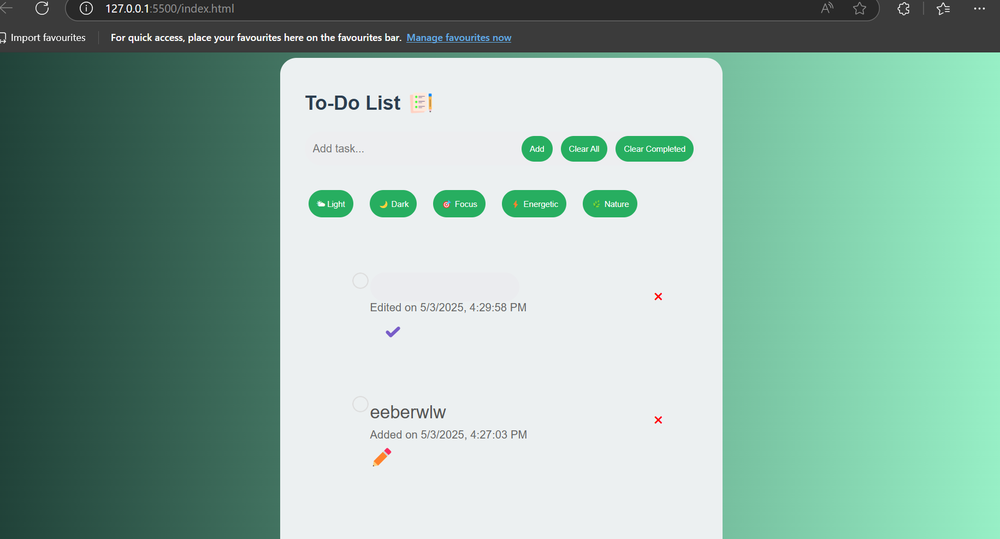
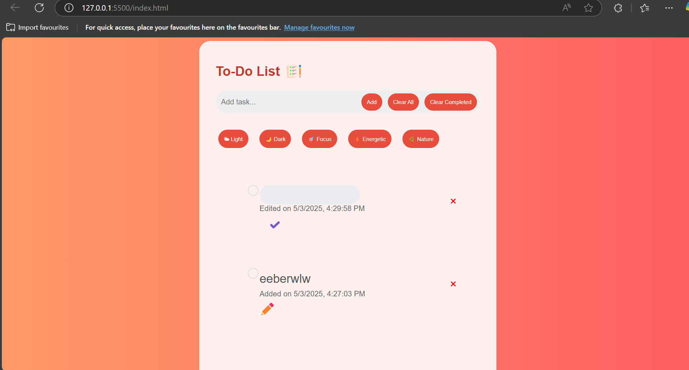
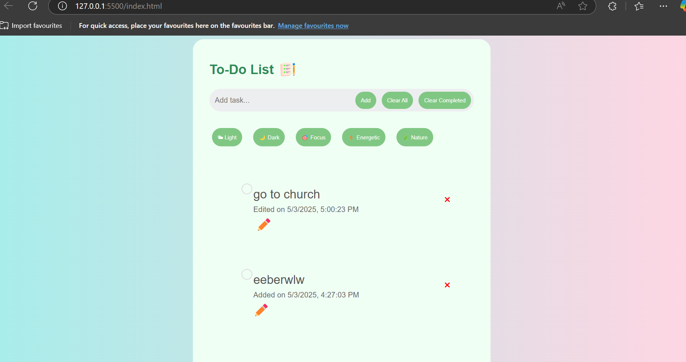

# redo-of-TO-DO-APP
A remake of the to-do app
You can add, edit, complete, and delete tasks.

Tasks and themes are persisted using localStorage.

Only one task can be edited at a time.

Timestamp is updated when a task is edited.

